# 👋 Hola, soy Aitor Alonso

### 💻 Estudiante de Desarrollo de Aplicaciones Web

¡Bienvenido a mi perfil! Soy **Aitor**, estudiante de **2.º año de FP de Grado Superior en Desarrollo de Aplicaciones Web (DAW)** y actualmente estoy dando mis primeros pasos en el mundo del desarrollo.

Me considero una persona **trabajadora, detallista y extrovertida**, a la que le gusta aprender y mejorar constantemente.

---

## 🚀 Sobre mí

* 🎓 Estudiante de **2.º año de DAW**
* 🌱 Actualmente aprendiendo y mejorando mis conocimientos de desarrollo web
* 💼 Mi objetivo es encontrar una oportunidad laboral relacionada con mis estudios
* 🎮 Me gustan los videojuegos y la tecnología
* 🤝 Me gusta trabajar en equipo y conectar fácilmente con otras personas
* 🔎 Soy una persona muy detallista y me gusta cuidar los proyectos hasta conseguir un buen resultado
* 💪 Soy trabajador, atento y constante
* 🧠 Aunque algo pueda costarme al principio, cuando lo entiendo me esfuerzo por hacerlo lo mejor posible
* 🏪 Tengo experiencia profesional como dependiente

---

## 📊 Mi actividad en GitHub

<p align="center">
  <picture>
    <source media="(prefers-color-scheme: dark)" srcset="assets/rainbow-dark.svg">
    <source media="(prefers-color-scheme: light)" srcset="assets/rainbow-light.svg">
    
  </picture>
</p>

</p>

---

## 🛠️ Tecnologías y conocimientos

Actualmente mis conocimientos son:

```text
🌐 Desarrollo web en entorno cliente
🖥️ Desarrollo web en entorno servidor
🎨 Diseño de interfaces web
🚀 Despliegue de aplicaciones web
🗄️ Bases de datos
💻 Programación
🇬🇧 Inglés profesional
💼 Itinerario Personal para la Empleabilidad
📂 Proyecto Intermodular de Desarrollo de Aplicaciones Web

Lenguajes aprendidos
├── HTML
├── CSS
├── JavaScript
└── Python
└── PHP
└── ...

🔧 Herramientas
├── Git
├── GitHub
└── Oracle
└── Visual Studio Code (VSC)
└── Pycharm
└── XAMPP
└── ...
```

> Esta sección irá creciendo a medida que avance en mi formación y en mis proyectos.

---

## 📚 Formación

### 🎓 Desarrollo de Aplicaciones Web — DAW

**FP de Grado Superior**

Actualmente cursando **2.º año**.

También cuento con:

* 🎓 Título de Bachillerato
* 🇬🇧 Inglés **B1**
* 🎧 Nivel **B2 en Listening**

---

## 💼 Experiencia

### 🏪 Dependiente

Experiencia trabajando de cara al público, desarrollando habilidades como:

* 🤝 Atención al cliente
* 🗣️ Comunicación
* 👥 Trabajo en equipo
* 🎯 Responsabilidad
* ⚡ Adaptación a diferentes situaciones

---

## 🎮 Un poco más sobre mí

Fuera del mundo de la programación, me gustan especialmente los **videojuegos** y pasar tiempo con otras personas.

Soy bastante **extrovertido**, por lo que normalmente me resulta fácil conectar con la gente.

También soy muy **detallista**. Cuando hago un proyecto, me gusta dedicarle tiempo para que el resultado final sea algo de lo que pueda estar orgulloso.

---

## 📂 Mis proyectos

Aquí iré publicando proyectos realizados durante mi formación y proyectos personales.

| Proyecto        | Descripción                          |
| --------------- | ------------------------------------ |
| 🚧 Próximamente | Estoy trabajando en nuevos proyectos |
| 🚧 Próximamente | Más proyectos próximamente           |

---

## 📫 Contacto

Si quieres conocer más sobre mis proyectos o contactar conmigo profesionalmente, puedes hacerlo a través de mis perfiles:

* 💻 **GitHub:** [AitorAlonso-Hub](https://github.com/AitorAlonso-Hub)
* 💼 **LinkedIn:** ...
* 📧 **Email profesional:** ...

---

<div align="center">

### 🚀 Gracias por visitar mi perfil

**Siempre aprendiendo, siempre mejorando.**

⭐ Si alguno de mis proyectos te resulta interesante, ¡no dudes en echarle un vistazo!

</div>

